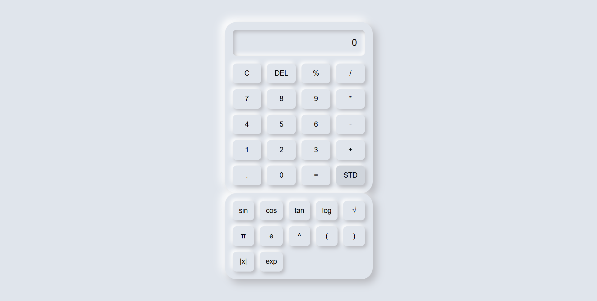

# Neumorphic Scientific Calculator

This project implements a neumorphic-styled scientific calculator using HTML, CSS, and JavaScript.

## Demo

  
  

## Features

- Basic arithmetic operations (+, -, *, /)
- Percentage calculation (%)
- Exponentiation (^)
- Trigonometric functions (sin, cos, tan)
- Logarithmic function (log)
- Square root (√)
- Constants (π, e)
- Absolute value (|x|)
- Exponential function (exp)
- Clear display (C)
- Delete last character (DEL)
- Toggle between standard and scientific modes (SCI / STD)

## Usage

1. Clone the repository:

To showcase two images side by side in Markdown format for your README file, you can use the following syntax:

markdown
Copy code
# Neumorphic Scientific Calculator

This project implements a neumorphic-styled scientific calculator using HTML, CSS, and JavaScript.

## Screenshots

 

## Features

- Basic arithmetic operations (+, -, *, /)
- Percentage calculation (%)
- Exponentiation (^)
- Trigonometric functions (sin, cos, tan)
- Logarithmic function (log)
- Square root (√)
- Constants (π, e)
- Absolute value (|x|)
- Exponential function (exp)
- Clear display (C)
- Delete last character (DEL)
- Toggle between standard and scientific modes (SCI / STD)

## Usage

1. Clone the repository:
git clone https://github.com/MohammedSardarSaajit4488/CODSOFT.git

2. Open `index.html` in your web browser.

3. Use the calculator:
- Click on the buttons to input numbers and operations.
- Use `C` to clear the display.
- Use `DEL` to delete the last character.
- Toggle between standard and scientific modes using the `SCI` / `STD` button.

## Author

Mohammed Sardar Saajit

## License

This project is licensed under the MIT License - see the LICENSE file for details.
